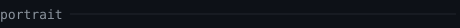
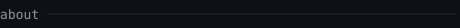
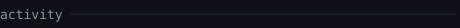
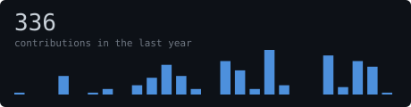
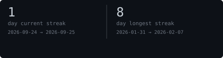
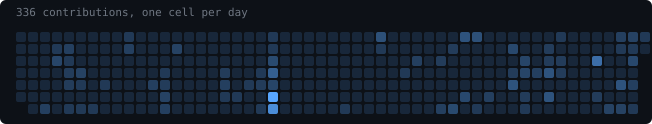
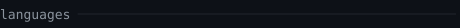
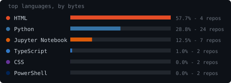

 

<blockquote>
Dual Degree student at IIT Kharagpur (Mining Engineering + CS minor),
building AI systems for domains where being wrong is expensive.
</blockquote>

 

Mining Engineering with a CS minor and an AI micro-specialization. 
Production experience with agentic data pipelines, multimodal search, 
and spiking neural network control. Nationally-winning SIH 2025 team 
for an AI digital twin for mining operations. Currently building 
NorthPixel — fixed-price AI phone agents for small businesses.

<samp>Python · C++ · LangGraph · Kafka · PyTorch · AWS</samp>

 
 
 

 

---

Portrait and stats are generated inside this repo by a scheduled
GitHub Action — no third-party widgets. See <samp>scripts/</samp>.
