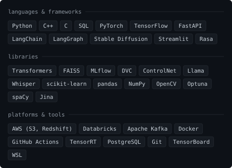
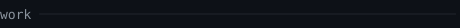

 

<blockquote>
M.Tech Dual Degree at IIT Kharagpur &mdash; Mining Engineering, CS minor,
micro-specialisation in AI. I build AI systems for industrial processes, where
being approximately right is the same as being wrong.
</blockquote>

 

I work at the seam between heavy industry and modern AI. At the **University of Oulu** I replaced a classical CVXPY QP solver with a neuromorphic LIF spiking engine for real-time predictive control, holding overshoot to 20.04&nbsp;&deg;C against 15&nbsp;&deg;C thermal disturbances on a non-linear MPC digital twin. At **Lumi** I shipped an SDXL pipeline (LoRA + ControlNet, 15K garments, 92% structural fidelity) and a CLIP + FAISS/HNSW multimodal index over 500K style embeddings at 120&nbsp;ms, then cut serving VRAM 45% with TensorRT and Triton. At **IBS Software** I built a 50K events/s Kafka pipeline and a LangGraph multi-agent orchestrator that resolves regulatory anomalies at 96% accuracy. In December 2025 my team were **national winners of Smart India Hackathon** for an AI digital twin of an iron-ore comminution circuit &mdash; 31.7% less energy, ~$1.58M projected annual savings.

<!-- SOCIAL / CONTACT LINKS -->

  
  

 

 

**Research Intern** &middot; University of Oulu, Finland &middot; May&ndash;Jul 2026 
Real-time predictive control for non-linear industrial heating &mdash; a neuromorphic LIF spiking engine standing in for classical QP, with exact trajectory equivalence.

**AI &amp; MLOps Intern** &middot; Lumi &middot; Jan&ndash;Feb 2026 
Generative and multimodal search for fashion discovery &mdash; SDXL + LoRA/ControlNet, a 500K-embedding CLIP/FAISS index at 120&nbsp;ms, TensorRT and Triton serving.

**AI Intern** &middot; IBS Software &middot; May&ndash;Jun 2025 
Event-driven logistics data platform &mdash; Kafka at 50K&nbsp;ev/s into S3, Databricks and Redshift, with a LangGraph multi-agent orchestrator over a FastAPI backend.

**National Winner** &middot; Smart India Hackathon 2025 &middot; Aug&ndash;Dec 2025 
AI digital twin for iron-ore comminution &mdash; a PPO RL agent cutting energy 31.7%, LSTM/Random-Forest fault prediction at 92.3%, and a RAG co-pilot over live SCADA.

 
 
 

 

---

The four activity cards are refreshed nightly by a scheduled GitHub Action.
The portrait, headings and skills card are drawn from <samp>photo.jpg</samp> and
plain Python on demand &mdash; no third-party widgets anywhere. See <samp>scripts/</samp>.
